Study question: Can we monitor drought using historical events/data?

#Objective:

* To calculate the standard precipitation index (spi) from previews rainfall data.

* To interpolate the Spi results for the study area.

* To analyse the trend  of drought conditions in these areas.

#Introduction

South Africa has 9 provinces, namely, Mpumalanga, Gauteng, Free State, Kwazulu Natal, Eastern Cape, Western Cape, Northern Cape and Limpopo. The country has mainly two rainfall regimes, namely winter rainfall areas and Summer rainfall Areas. The Winter rainfall areas receive much of the rainfall during the winter months compared to Summer rainfall areas that receive rainfall during the summer months.The summer season starts from December through to February while winter starts from June to August. 

The Study area, KwaZulu Natal, is a summer rainfall area. During this time, the province receive more rainfall. Most farmers in this province, depends on rainfall for irrigation and for their farming activities. it is therefor critical that enough rainfall is received during this time as this has a further implication on the following dry winter for this area. 

Drought, therefore is a major concern for the farmers in these areas and if this conditions can be monitored, it would inform the farmers to prepare for any possibilities of drought. The province experience extended dry period approximately once in five years. However, severe drought conditions can be experienced once in ten years. 

The Standard Precipitation Index (SPI) is once of the widely used drought indices globally. The level of drought is determined but the SPI value; i.e. 

Positive SPI values indicate greater than median precipitation and negative values indicate less than median precipitation. Drought periods are represented by relatively high negative deviations. Normally, the 'drought' part of the SPI range is arbitrary split into: 

* moderately dry (-1.0 > SPI > -1.49), 
* severely dry (-1.5 > SPI > -1.99) and 
* extremely dry conditions (SPI < -2.0). 

A drought event starts when SPI value reaches -1.0 and ends when SPI becomes positive again (McKee et al., 1993).

The data used in the calculation of the SPI its point data. Therefore, to get a coverage outlook of the study area, the SPI values needed to be interpolated between the points. The Inverse Distance Weighted Interpolation was used to interpolate the SPI values. 


#Methodology

Loading libraries used in the project
```{r, echo = TRUE, message=FALSE}
# Load Libraries
library(reshape)
library(rgdal)
library(sp)
library(spatstat)
library(spi)
library(gstat)
library(raster)
library(ggplot2)
library(animation)
```

The following functions were created. The details of these functions are in the GITHUB repository.

```{r source, echo=TRUE}
# calling the functions
source('R/selecting.R')
source("R/CalculateSPI.R")
source('R/CreateMonthlySpi.R')
source('R/CreatingRasterBrick.R')
source('R/CreatingGraphs.R')
source('R/CreatingGif.R')
source('R/CreatingGifMonthly.R')

```

Reading data from csv files
```{r}
Rainfall <- read.csv("data/STATIONS_All Stations (1).csv", header = TRUE)
Stations <- read.csv("data/station.csv", header = TRUE)
```

The data was downloaded from the SASRI web page and saved as CSV files. The structure of the rainfall data was not in a way suitable for the calculation of the SPI. There were only the following column (ID,  NAME,	MONTH,	YEAR,	RAIN,	TMEAN). It was therefore necessary to reshape the rainfall data. Using the reshape package and the cast function, the rainfall data was reshaped to these column (ID  NAME	MONTH  all the YEARS as Columns for each year)

```{r}
#reshape the rainfall data
newrainfal <- cast(Rainfall, ID+NAME+MONTH~YEAR, value = 'RAIN')
```

The Provincial boundary of the the of KwaZulu Natal was then downloaded from the GADM open source data.
```{r}
#get administative boundries for South Africa and KZN
SouthAfricaAdm <- raster::getData("GADM", country = "ZAF", level = 2)
KznAdm <- SouthAfricaAdm[SouthAfricaAdm$NAME_1 == "KwaZulu-Natal",]
plot(SouthAfricaAdm, main = "South AFRICA")
plot(SouthAfricaAdm[SouthAfricaAdm$NAME_1 == "KwaZulu-Natal",], add = TRUE, col = "red")
```


```{r}
# create spatial points from station coordinates
Station_Points <- cbind(Stations$Longitude, Stations$Latitude)
prj_string_WGS <- CRS("+proj=longlat +ellps=WGS84 +datum=WGS84 +no_defs +towgs84=0,0,0")
mypoints <- SpatialPointsDataFrame(Station_Points, proj4string=prj_string_WGS, data = Stations, match.ID = T)
plot(SouthAfricaAdm[SouthAfricaAdm$NAME_1 == "KwaZulu-Natal",], main = "Stations")
plot(mypoints, add = T, xlab = "Longitude", ylab = "Latitude", col=sample(rainbow(12)))
grid()
box()
```

The weather stations were established from different times. Therefore, the recording started at different time periods. To eliminate no data period for some stations, we decided to select from years where all the stations have records, i.e. from 1997 to 2014.

```{r}

# selection of the rainfall data in KZN province and removing the no data years
kznrainfall <- selecting(newrainfal, Stations)

```


the SPI was calculated using the calculateSPI function, the number in the code, represent the ID of the station

```{r, message=FALSE, results='hide'}
# SPI calculation 
Pongola <- CalculateSPI(kznrainfall, 6)
Mkuze <- CalculateSPI(kznrainfall, 154)
Eshowe <- CalculateSPI(kznrainfall, 142)
Eston <- CalculateSPI(kznrainfall, 458)
Glenside <-CalculateSPI(kznrainfall, 8)
Hibberdene <-CalculateSPI(kznrainfall, 106)
Kearsney <-CalculateSPI(kznrainfall, 129)
Melmoth <-CalculateSPI(kznrainfall, 12)
MtEdgecombe <-CalculateSPI(kznrainfall, 461)
Paddock <-CalculateSPI(kznrainfall, 48)
StLucia <-CalculateSPI(kznrainfall, 452)
Wartburg <-CalculateSPI(kznrainfall, 455)
```


```{r}

# Create a monthly Spi table for each month
StationsList <- list(Pongola, Mkuze, Eshowe, Eston, Glenside, Hibberdene, Kearsney, Melmoth, MtEdgecombe, Paddock, StLucia, Wartburg)

Jan <- CreateMonthlySpi(StationsList, 1)
Feb <- CreateMonthlySpi(StationsList, 2)
Mar <- CreateMonthlySpi(StationsList, 3)
Apr <- CreateMonthlySpi(StationsList, 4)
May <- CreateMonthlySpi(StationsList, 5)
Jun <- CreateMonthlySpi(StationsList, 6)
Jul <- CreateMonthlySpi(StationsList, 7)
Aug <- CreateMonthlySpi(StationsList, 8)
Sep <- CreateMonthlySpi(StationsList, 9)
Oct <- CreateMonthlySpi(StationsList, 10)
Nov <- CreateMonthlySpi(StationsList, 11)
Dec <- CreateMonthlySpi(StationsList, 12)


```


The SPI results was just a data frame of values without spatial reference. Therefore, we merged the SPI results to the station points. These linked the SPI values to specific points in the study area, specific month and for specific year. 

```{r}
# merge stations with monthly SPI data
JanSpi <- merge(Stations, Jan, by.x = "ID", by.y = "id")
FebSpi <- merge(Stations, Feb, by.x = "ID", by.y = "id")
MarSpi <- merge(Stations, Mar, by.x = "ID", by.y = "id")
AprSpi <- merge(Stations, Apr, by.x = "ID", by.y = "id")
MaySpi <- merge(Stations, May, by.x = "ID", by.y = "id")
JunSpi <- merge(Stations, Jun, by.x = "ID", by.y = "id")
JulSpi <- merge(Stations, Jul, by.x = "ID", by.y = "id")
AugSpi <- merge(Stations, Aug, by.x = "ID", by.y = "id")
SepSpi <- merge(Stations, Sep, by.x = "ID", by.y = "id")
OctSpi <- merge(Stations, Oct, by.x = "ID", by.y = "id")
NovSpi <- merge(Stations, Nov, by.x = "ID", by.y = "id")
DecSpi <- merge(Stations, Dec, by.x = "ID", by.y = "id")

```


Before the interpolation of the SPI values, we needed to specify the extent of the study area. The extent of the area was determined by the extent of the the spatial location of the weather station.
```{r}
# Rasterize the SPI data, first define the grid extent:
x.range <- as.numeric(c(30.2667, 32.2833))  # min/max longitude of the interpolation area based on mypoints
y.range <- as.numeric(c(-30.75, -25.55))  # min/max latitude of the interpolation area based on mypoints

```

Then, we created a data frame from all combinations of the supplied vectors or factors. Set spatial coordinates to create a Spatial object. Assign gridded structure
```{r}

grd <- expand.grid(x = seq(from = x.range[1], to = x.range[2], by = 0.1), y = seq(from = y.range[1], to = y.range[2], by = 0.1))  # expand points to grid
coordinates(grd) <- ~ x + y
crs(grd) <- CRS("+proj=longlat +ellps=WGS84 +datum=WGS84 +no_defs +towgs84=0,0,0")
gridded(grd) <- TRUE

```


Create the monthly raster brick for all the years(1997-2014)
```{r, message=FALSE, results='hide'}
January <- CreatingRasterBrick(JanSpi, mypoints)
February <- CreatingRasterBrick(FebSpi, mypoints)
March <- CreatingRasterBrick(MarSpi, mypoints)
April <- CreatingRasterBrick(AprSpi, mypoints)
May <- CreatingRasterBrick(MaySpi, mypoints)
June <- CreatingRasterBrick(JunSpi, mypoints)
July <- CreatingRasterBrick(JulSpi, mypoints)
August <- CreatingRasterBrick(AugSpi, mypoints)
September <- CreatingRasterBrick(SepSpi, mypoints)
October <- CreatingRasterBrick(OctSpi, mypoints)
November <- CreatingRasterBrick(NovSpi, mypoints)
December <- CreatingRasterBrick(DecSpi, mypoints)
```


Mask the raster brick using KZN boundaries
```{r}
Januarymask <- mask(January, KznAdm)
Februarymask <- mask(February, KznAdm)
Marchmask <- mask(March, KznAdm)
Aprilmask <- mask(April, KznAdm)
Maymask <- mask(May, KznAdm)
Junemask <- mask(June, KznAdm)
Julymask <- mask(July, KznAdm)
Augustmask <- mask(August, KznAdm)
Septembermask <- mask(September, KznAdm)
Octobermask <- mask(October, KznAdm)
Novembermask <- mask(November, KznAdm)
Decembermask <- mask(December, KznAdm)
```


Animation presentation of the raster brick for every month.
The following the functions were run from the virtual machine Linux, so it is not possible to execute the following codes on Windows, because the software ImageMagick was needed to be installed.

```{r, message=FALSE, results='hide'}
MonthsNames <- list("Jan", "Feb", "Mar", "Apr", "May", "Jun", "Jul", "Aug", "Sep", "Oct", "Nov", "Dec")

# CreatingGifMonthly(Januarymask, MonthsNames[1], KznAdm)
# CreatingGifMonthly(Februarymask, MonthsNames[2], KznAdm)
# CreatingGifMonthly(Marchmask, MonthsNames[3], KznAdm)
# CreatingGifMonthly(Aprilmask, MonthsNames[4], KznAdm)
# CreatingGifMonthly(Maymask, MonthsNames[5], KznAdm)
# CreatingGifMonthly(Junemask, MonthsNames[6], KznAdm)
# CreatingGifMonthly(Julymask, MonthsNames[7], KznAdm)
# CreatingGifMonthly(Augustmask, MonthsNames[8], KznAdm)
# CreatingGifMonthly(Septembermask, MonthsNames[9], KznAdm)
# CreatingGifMonthly(Octobermask, MonthsNames[10], KznAdm)
# CreatingGifMonthly(Novembermask, MonthsNames[11], KznAdm)
# CreatingGifMonthly(Decembermask, MonthsNames[12], KznAdm)
```


Plot the SPI trend in graph for each season.

##Summer:
```{r}

# plot the SPI trend for Summer
GraphDec <- CreatingGraphs(DecSpi, "December")
GraphJan <- CreatingGraphs(JanSpi, "January")
GraphFeb <- CreatingGraphs(FebSpi, "February")

```

##Autumn:
```{r}
# plot the SPI trend for Autumn
GraphMar <- CreatingGraphs(MarSpi, "March")
GraphApr <- CreatingGraphs(AprSpi, "April")
GraphMay <- CreatingGraphs(MaySpi, "May")
```

##Winter:
```{r}
# plot the SPI trend for Winter
GraphJun <- CreatingGraphs(JunSpi, "June")
GraphJul <- CreatingGraphs(JulSpi, "July")
GraphAug <- CreatingGraphs(AugSpi, "August")
```

##Spring:
```{r}
# plot the SPI trend for Spring
GraphSep <- CreatingGraphs(SepSpi, "September")
GraphOct <- CreatingGraphs(OctSpi, "October")
GraphNov <- CreatingGraphs(NovSpi, "November")

```


Ploting a Spi animation of the graph per station.

```{r, message=FALSE}
# CreatingGif(JanSpi, "January")
```
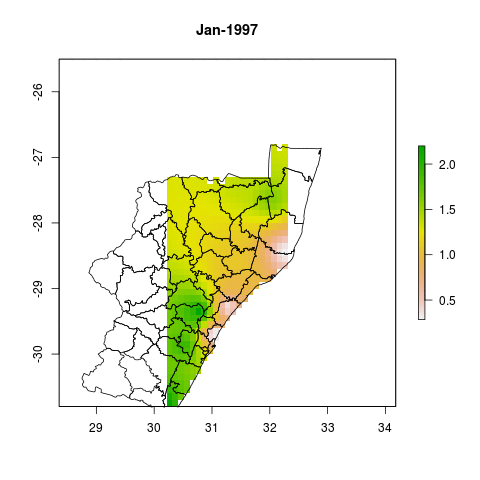

```{r, message=FALSE, results='hide'}
# CreatingGif(FebSpi, "February")
```
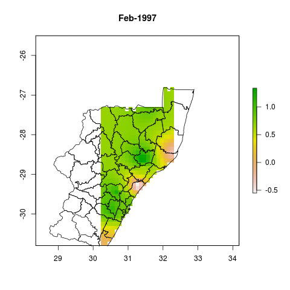

```{r, message=FALSE, results='hide'}
# CreatingGif(MarSpi, "March")
```
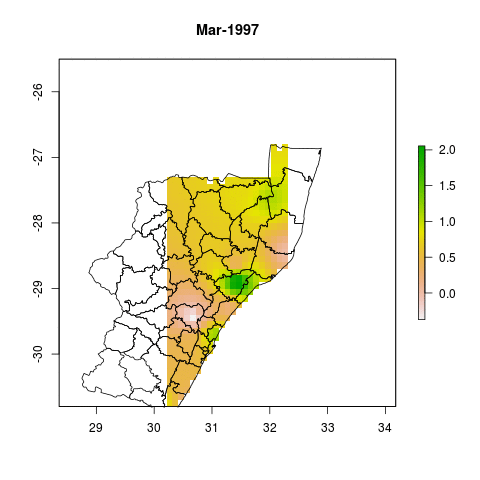

```{r, message=FALSE, results='hide'}
# CreatingGif(AprSpi, "April")
```
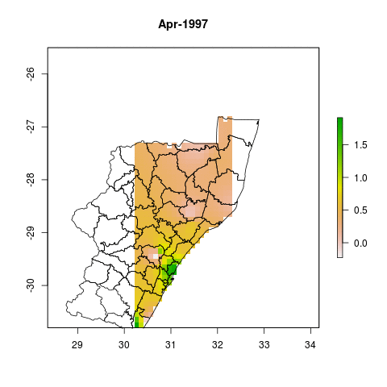

```{r, message=FALSE, results='hide'}
# CreatingGif(MaySpi, "May")
```
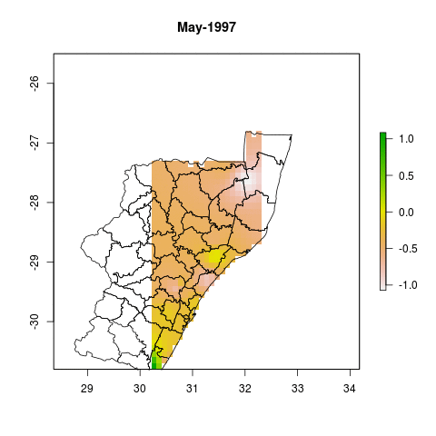

```{r, message=FALSE, results='hide'}
# CreatingGif(JunSpi, "June")
```
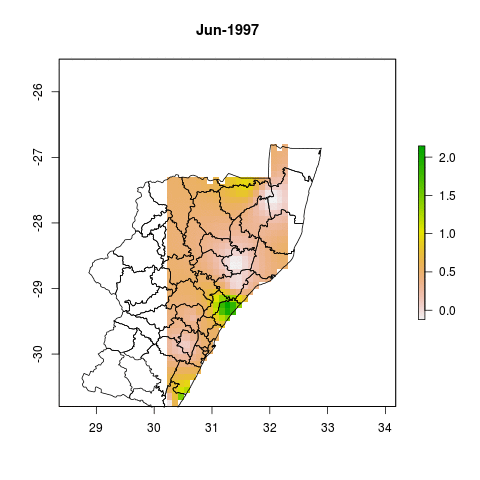

```{r, message=FALSE, results='hide'}
# CreatingGif(JulSpi, "July")
```
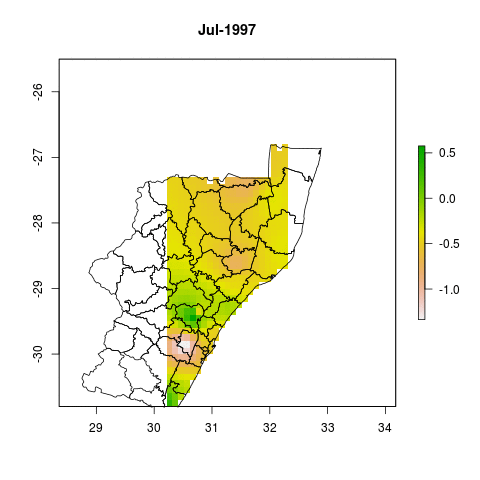

```{r, message=FALSE, results='hide'}
# CreatingGif(AugSpi, "August")
```
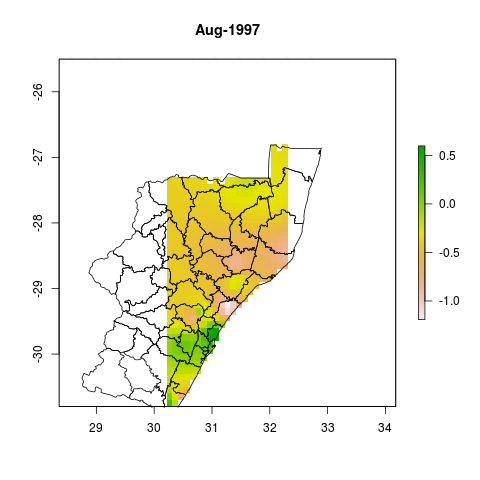

```{r, message=FALSE, results='hide'}
# CreatingGif(SepSpi, "September")
```
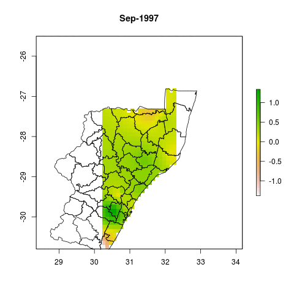

```{r, message=FALSE, results='hide'}
# CreatingGif(OctSpi, "October")
```
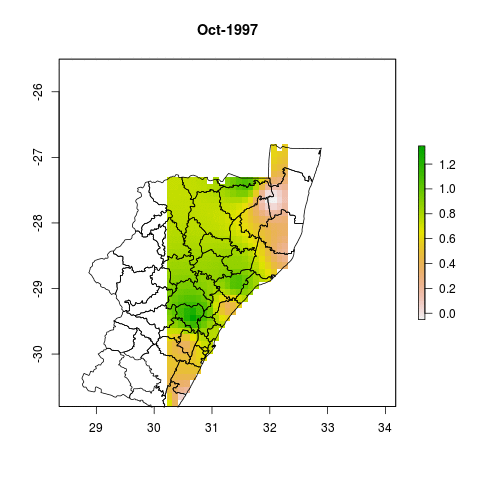

```{r, message=FALSE, results='hide'}
# CreatingGif(NovSpi, "November")
```
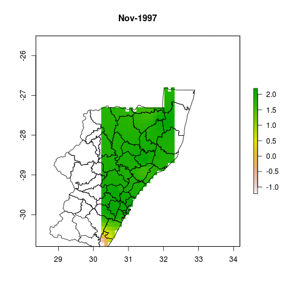

```{r, message=FALSE, results='hide'}
# CreatingGif(DecSpi, "December")
```
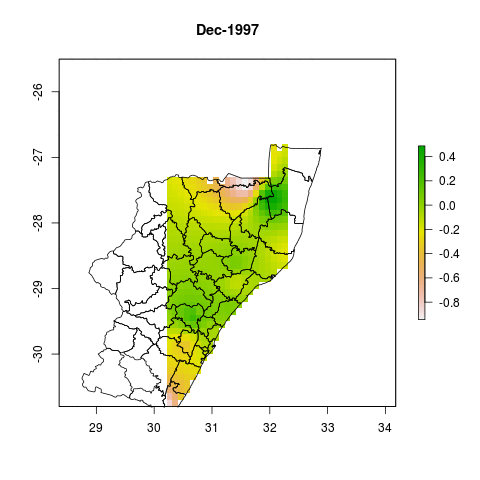

#Conclusion:

As Expected, the winter months are more drier than the Summer months are this area is a summer rainfall area.  However there are areas that recorded exceptionally wet months in the winter season in some years. As seen in the Yearly SPI for June, there are periods when all the areas were exceptionally wet than normal.This however not conclusive that once in ten every the areas would have wet conditions during this month because of the period considered in the analysis(i.e. 1997 - 2014 is not long enough for such conclusion).

The assessment also shows that the summer months experience dry conditions every after ten years, i.e. 2004 and 2014. As read from the the article: [linked phrase](http://www.iol.co.za/news/south-africa/kwazulu-natal/kzn-to-declare-drought-emergency-1.1762934#.VMogo2jF8qk) The Province of KwaZulu NAtal has declared a state of drought disaster.


